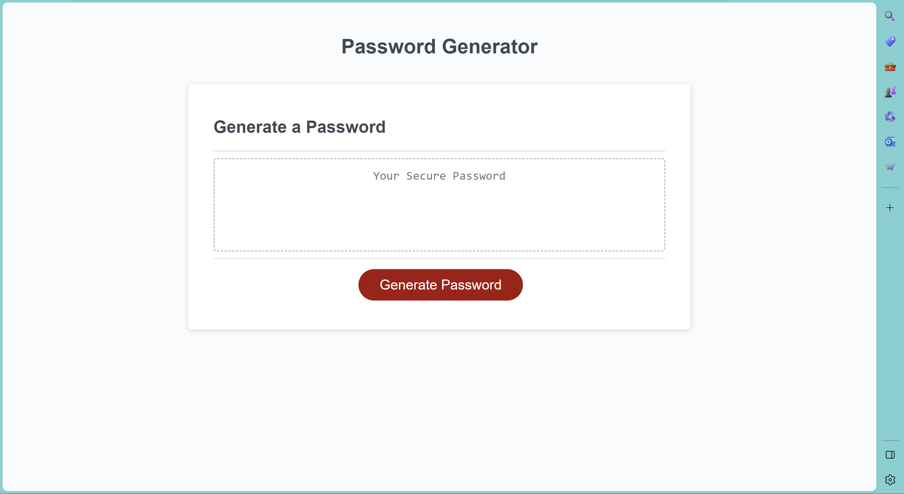
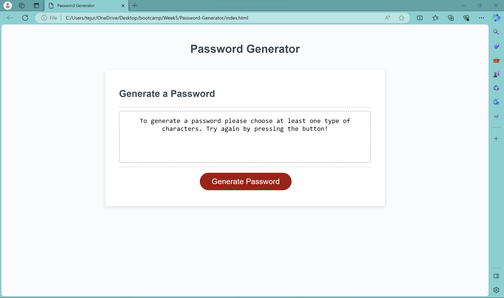
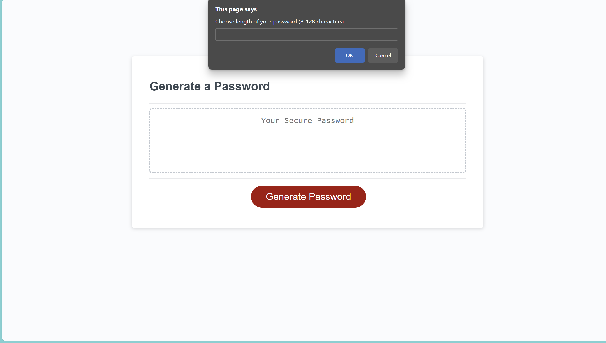
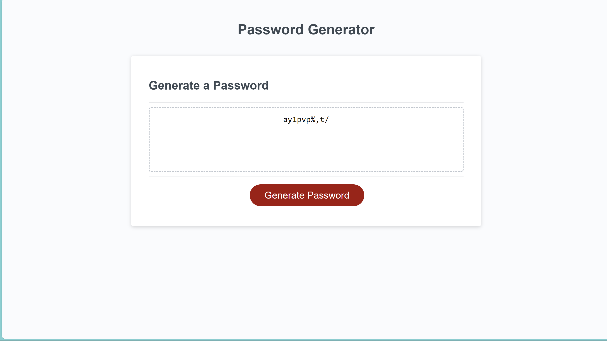

# Password-Generator

## Description

This webpage was created in response to a  boot camp assignment to apply skills learnt in JavaScript, particularly array methods. 

This app runs in the browser, and features dynamically updated HTML powered by JavaScript.

The webpage asks for user input through 'confirms' and generates a random password based on their choices. The user can elect to have lowercase characters, uppercase characters, special characters, and numerals in their password. They must choose at least one. They will then receive their password.

If a user does not confirm at least one type of character, the text box will tell them to try again:

## Installation

Accessible on Git Hub Pages at the link below in 'usage'.

## Usage
The site can be accessed here: 

Click the 'Generate Password' to begin. Input a number when asked for the length of password you'd like, and then click 'OK' for the following options if you want to include them, and 'Cancel' if you do not wish to include a particular character type. You must choose at least one character type to include. You will then see your randomly generated password in the text box! Copy it and use it wherever you'd like. 

Below is a series of images providing a brief demo. The first shows the first 'confirm'. I chose 10 characters as the length and said 'OK' to all character types except upper case. The second image shows the password resulting from running the process. 

## Credits

The source code for this project is taken from study materials from the bootcamp, and then edited to fulfill the learning objectives provided. 
